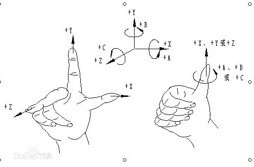

# WebGL

> WebGL 经常被当成 3D API，

## 概述

现实世界是三维立体的，现在的电子设备无一例外的是一块二维的平面玻璃。在二维平面上模拟三维需要巨大的计算量，一般需要借助 GPU 硬件来实现，OpenGL 是 GPU 硬件厂商的对外 API，显卡“驱动”它们负责将 OpenGL 定义的 API 命令翻译为GPU指令。从专业的工程和设计软件 AutoCAD，到日常用的美颜工具底层都是在调用 OpenGL。

WebGL 是一种 3D 绘图协议，是对 OpenGL ES 2.0 的一种封装，可以为 HTML5 Canvas 提供硬件 3D 加速渲染，这样Web开发人员就可以借助系统显卡来在浏览器里更流畅地展示3D场景和模型了，还能创建复杂的导航和数据视觉化。

WebGL 虽然已经对底层进行了很好的封装，但对于开发应用来说还是太简陋了点，于是再往上封装形成了很多第三方框架，知名的有开发应用类的 Three.js 和 开发游戏类的 Egert.js 等。

要想学习这方面的开发，我们先从 WebGL 开始学习基础概念和用法，然后针对应用方向学习框架。

## WebGL 基础概念

### 定点着色器 和 片段着色器

顶点着色器的作用是计算顶点的位置。根据计算出的一系列顶点位置，WebGL 可以对点，线和三角形在内的一些图元进行光栅化处理。

当对这些图元进行光栅化处理时需要使用片断着色器方法。片断着色器的作用是计算出当前绘制图元中每个像素的颜色值。

几乎整个 WebGL API 都是关于如何设置这些成对方法的状态值以及运行它们。 对于想要绘制的每一个对象，都需要先设置一系列状态值，然后通过调用 `gl.drawArrays` 或 `gl.drawElements` 运行一个着色方法对，使得你的着色器对能够在GPU上运行。

着色器获取数据的 4 种方法:

- 属性（Attributes）和缓冲

缓冲是发送到 GPU 的一些二进制数据序列，通常情况下缓冲数据包括位置，法向量，纹理坐标，顶点颜色值等。你可以存储任何数据。

WebGL 只关心两件事：裁剪空间中的坐标值和填充颜色。使用 WebGL 只需要给它提供这两个东西。你需要提供两个着色器来做这两件事，一个顶点着色器提供裁剪空间坐标值，一个片断着色器提供颜色值。

### 坐标系

既然绘制 3D 图形，必然会有对应的三维坐标系，WebGL 采用右手坐标系，并且无论你的画布有多大，裁剪空间的坐标范围永远是 -1 到 1。

### 

## Hello world 之 画三角形

[Demo](/articles/WebGL/demo/hello-world-triangle.html)

## WebGL 基础用法

## 参考

[WebGL 基础教程](https://webglfundamentals.org/)
