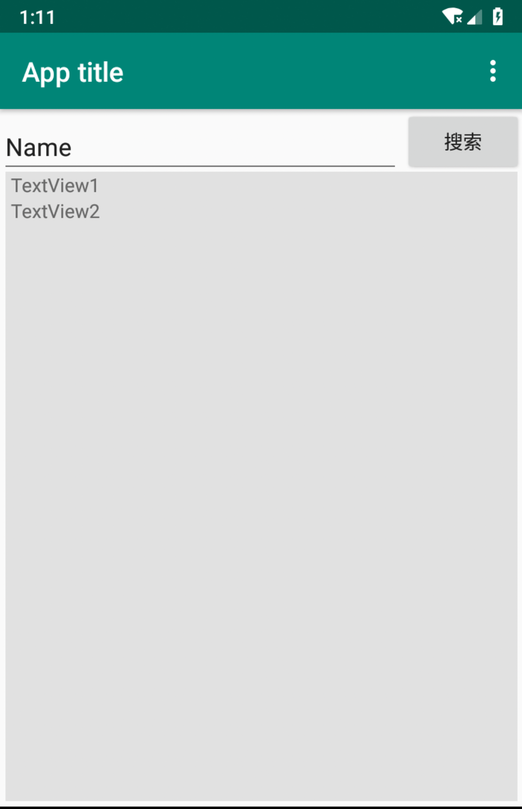

# Android Native

> Android 原生 App 自学笔记。

## 概要

2007.11.05 谷歌推出。

Android 是一种基于 Linux 的开放源代码软件栈，为各类设备和机型而创建。原产于名为 Android.Inc 的一家独立公司，2005 年被谷歌收购。Android Native 是运行在该系统上的一种应用形式。

主要版本:
- Android 1.1, 发布于 2008.09
- Android 2.0, 发布于 2009.10.26, 代号 Eclair(松饼)
- Android 3.0, 发布于 2011.02.03, 代号 Honeycomb(蜂巢)
- ...
- Android 9.0, 发布于 2018.05.09, 代号 Pie(派)
- Android 10.0(Android Q), 预计今年到达战场，之后不会再按照基于美味零食或甜点的字母顺序命名，而是转换为版本号。开始提供系统级的黑暗模式，大部分预装应用、抽屉、设置菜单和 Google Feed 资讯流等界面和按钮，都会变成以黑色为主色调，就和你在 macOS Mojave 中看到的暗色界面一样。

经过 10 年 10 个版本的更新，之前的很多问题现在已经不是问题了，我们需要跟着最新的教程来学。Android Native 的开发整体再走下坡路，新教程比较少，只能把网上零散的资料拼接起来。

## IDE 的选择

看了最近几年国外的一下文章，IntelliJ IDEA 和 Android Studio 是全世界 Android 开发者比较推荐的，前者收费后者免费，再结合教程的丰富程度选择了 Android Studio。

官网: https://developer.android.com/studio

遇到的问题:

- Unable to access Android SDK add-on list

由于国内网络环境 Android SDK 和其他一些组件安装失败，搞到很晚没解决，最可气的是官方说不应该有这问题，看来外国人不了解我天朝上国，第二天有点忙在夜深人静的时候开始研究，试着卸载重装居然通过了。我的梯子很给力。

## Phone, hello world

 2016 年之前 Android Native 的开发语言只有 Java 可选，2016年2月15日发布了 Kotlin。这比较像当年的 Objective-C 和 Swift，Objective-C 是 1980 发明的语言，它进入大众视野是伴随 2007 年第一代 Iphone 的发布。Swift 是 2014 年发布的，面对领先 7 年的 Objective-C，经过 5 年的追赶依然被压一头(可以参考 2019.07 (PYPL)[http://pypl.github.io/PYPL.html] 发布的全球语言受欢迎排行榜)。所以我们当下不打算进入 Kotlin 的学习，而是依然以 Java 为主。

Android Studio 第一映像很不错，第一次进入有多种应用可以选择:
- Phone and Tablet, 手机和平板
- Wear OS, 智能手表
- TV
- Andriod Auto, 车载应用
- Andriod Things, 嵌入式设备应用(自动售货机, 智能门禁, 物联网)

选择 Phone and Tablet，任意选择一个模板，选择一下 Java 语言和 Android 9.0，一个项目就生成了，下载依赖需要一些时间耐心等待。在 /app/src/main/res/layout 下就是页面了(注意左上角有 Android 和 Project Files 等多种显示模式)，点开可以大体预览页面。

手头没有真机的可以先用模拟器玩着，这里介绍外挂 Genymotion 模拟器，配置方法如下:
- 1. 安装 VirtualBox，从 https://www.virtualbox.org/wiki/Downloads 下载
- 2. 安装 Genymotion，从 https://www.genymotion.com/download/ 下载 Genymotion。下载是要用邮箱注册账号后才能下载。
- 3. 启动 Genymotion 并登录，Next。
- 4. accept agreement, Next.
- 5. 选择手机安装，比如选择 Samsung Galaxy S10，409M 装的比较慢，手机类型并不全，集中在 Samsung、Google、HTC。
- 6. 点击手机右侧图标，start 启动手机，启动成功后可以看到一个手机页面(你可以同时启动多个手机)。
- 7. 在 Android Studio 上可以看到我们刚才启动的手机，选择一个就可以用模拟器看写的页面了。

模拟器的机型并不全，连我中华大华为都没有，差评。直接真机调试比较简单，配置如下:

- 1. Android Studio，顶部 app / Edit / USB Device。
- 2. 手机上打开设置，点开”开发者选项“，将”USB调试打开“。
- 3. Android 4.2 以后的系统可以隐藏”开发者选项“，点击“关于手机”，然后连续多次点击“版本号”，可以将”开发者选项“的隐藏取消掉，返回设置中就可以看到了。

连上手机之后运行的时候报 “Session 'app': Installation did not succeed.”

## 系统性学习 - 入门

### 概述

在搭建完前面的步骤后我们就可以进入系统性学习的步骤了，高效直接的方式是参照官方文档再结合第三方的视角，于是选择了下面两个参考资料:

- 官方资料: [Android Training](http://hukai.me/android-training-course-in-chinese/index.html), [Android API Guides](https://developer.android.com/guide/index.html).
- 中文书推荐: 《疯狂Android讲义(第4版)》.

交互软件离不开三样东西: 布局，功能组件，事件。组件是实现特定功能的封转，布局是对交互元素的管理，事件连接着用户行为和数据的处理与展示。

Android 的图形用户界面由多个视图（View）和视图组（ViewGroup）构建而成。View 是通用的 UI 窗体小组件，如：按钮（Button）、文本框（Text field）；而 ViewGroup 则是用来定义子视图布局的不可见的容器，如：网格部件（grid）、垂直列表部件（vertical list）。

Android 提供了一系列对应于 View 和 ViewGroup 子类的 XML 标签，以便我们用 XML 创建自己的 UI。Layouts 是 ViewGroup 的子类。


View 对象通常称为“微件”，可以是众多子类之一，例如 Button 或 TextView。ViewGroup 对象通常称为“布局”，可以是提供其他布局结构的众多类型之一，例如 LinearLayout 或 ConstraintLayout。

结合前端的经验我把布局组件和功能组件做如下分类:

```
Android UI
    ├── 影响位置的控件:
        ├── Layouts: ConstraintLayout, LinearLayout, TableLayout 等
        ├── Containers: Spinner, ScrollView, include, merge 等
        └── Legacy: GridLayout, GridView, ListView 等
    └── 承载交互功能的控件
        ├── Widget: WebView, ProcessBar, SearchView 等
        ├── Text: TextView, E-mail, Phone 等
        ├── Buttons: Button, ChecBox, Switch
        └── Google: MapView, AdView
```

原生提供的控件就像 web 中浏览器提供的标签，是基础，复杂的控件都是基于基础控件的组合封装，原生的功能较弱，一般都会搭配 UI 库来使用。

下面我们的学习思路是先单页再多页，单页中又先“容器和布局”再“功能组件”最“后组件交互和多页跳转”。

### 界面编程 - 容器和布局

先整理一下前面 hello world 的代码:

```
${project root}
    ├── app/src/main   主要代码
        ├── res
            ├── layout
                ├── activity_main.xml 框架页，定义了页面框架，通过 include 将下面 content_main.xml  文件引入
                └── content_main.xml 内容页文件，ConstraintLayout 内含 TextView 组件
            ├── menu/menu_main.xml  导航文件，并没有像 content_main.xml 一样被 activity_main.xml 直接 include 进界面，而是通过下面的 MainActivity.java 文件
            └── values/ 定义一系列文案和色值等
        └── java/com/xiaoqiangzhao/android_hello_word/MainActivity.java 主控制文件
```

容器先讲 4 个: include, merge, ConstraintLayout, LinearLayout。

Android系统中已经提供了非常多好用的控件，这让我们在编写布局的时候可以很轻松。但是有些时候我们可能需要反复利用某个已经写好的布局，如果你总是使用复制粘贴的方式来进行布局重用，这显然是一种很笨的做法。而Android当然也已经充分考虑到了布局重用的重要性，于是提供了 include 和 merge 这两个非常有用的标签，下面我们就来逐个学习一下。

include 标签可以允许在一个布局当中引入另外一个布局，那么比如说我们程序的所有界面都有一个公共的部分，这个时候最好的做法就是将这个公共的部分提取到一个独立的布局文件当中，然后在每个界面的布局文件当中来引用这个公共的布局。在前面的 hello world 示例中 activity_main.xml 就将 content_main.xml 引入了进来。

看一下 content_main.xml 的代码:

```xml
<?xml version="1.0" encoding="utf-8"?>
<androidx.constraintlayout.widget.ConstraintLayout xmlns:android="http://schemas.android.com/apk/res/android"
    xmlns:app="http://schemas.android.com/apk/res-auto"
    xmlns:tools="http://schemas.android.com/tools"
    android:layout_width="match_parent"
    android:layout_height="match_parent"
    app:layout_behavior="@string/appbar_scrolling_view_behavior"
    tools:context=".MainActivity"
    tools:showIn="@layout/activity_main">

    <TextView
        android:layout_width="wrap_content"
        android:layout_height="wrap_content"
        android:text="Hello World!"
        app:layout_constraintBottom_toBottomOf="parent"
        app:layout_constraintLeft_toLeftOf="parent"
        app:layout_constraintRight_toRightOf="parent"
        app:layout_constraintTop_toTopOf="parent" />

</androidx.constraintlayout.widget.ConstraintLayout>
```

每一个 layout xml 都需要有一个根节点，上面的容器用的是 ConstraintLayout，引用的页面中如果还引用了其他页面那就会出现多层容器嵌套，Android 去解析和展示一个布局是需要消耗时间的，布局嵌套的越多，那么解析起来就越耗时，性能也就越差，因此我们在编写布局文件时应该让嵌套的层数越少越好。所有容器中消耗资源最少的是 merge，不产生实际的嵌套，只引入 merge 标签中的内容。我们新建一个 merge_main.xml，内容如下:

```xml
<?xml version="1.0" encoding="utf-8"?>
<merge xmlns:android="http://schemas.android.com/apk/res/android">

    <Button
        android:id="@+id/ok"
        android:layout_width="match_parent"
        android:layout_height="wrap_content"
        android:layout_marginLeft="20dp"
        android:layout_marginRight="20dp"
        android:text="OK" />

</merge>
```

然后在 content_main.xml 中引入 merge_main.xml，将 `<include layout="@layout/merge_main"/>` 放在 TextView 下面。然后点击 Tool / Layout Inspector 就会看到组件的层级嵌套分析结果，可以看到 TextView 与 Button 是同级的，并没有产生容器和深一层的嵌套。你会发现 Button 怎么跑到上面去了，怎么把它放下下面呢？这就要讲讲 ConstraintLayout 和 LinearLayout 了。

ConstraintLayout，约束布局，内部全部 View 位于左上角。
LinearLayout，线性布局，分为从左到右和从上到下两种形式，组件会按照顺序排列。

我们实现下图这种布局:



标签较少，效率较高的写法是这样，content_main.xml:

```xml
<androidx.constraintlayout.widget.ConstraintLayout xmlns:android="http://schemas.android.com/apk/res/android"
    xmlns:app="http://schemas.android.com/apk/res-auto"
    xmlns:tools="http://schemas.android.com/tools"
    android:layout_width="match_parent"
    android:layout_height="match_parent"
    app:layout_behavior="@string/appbar_scrolling_view_behavior"
    tools:context=".MainActivity"
    tools:showIn="@layout/activity_main">

    <EditText
        android:id="@+id/editText"
        android:layout_width="match_parent"
        android:layout_height="wrap_content"
        android:layout_marginEnd="90dp"
        android:layout_marginTop="5dp"
        android:inputType="textPersonName"
        android:text="Name"
        app:layout_constraintEnd_toEndOf="parent"
        app:layout_constraintLeft_toLeftOf="parent"
        app:layout_constraintTop_toTopOf="parent" />

    <Button
        android:id="@+id/button"
        android:layout_width="wrap_content"
        android:layout_height="wrap_content"
        android:text="搜索"
        app:layout_constraintTop_toTopOf="parent"
        app:layout_constraintRight_toRightOf="parent"/>

    <LinearLayout
        android:id="@+id/linearLayout"
        android:background="#e1e1e1"
        android:layout_width="match_parent"
        android:layout_height="match_parent"
        android:orientation="vertical"
        android:layout_marginTop="46dp"
        android:layout_marginLeft="4dp"
        android:layout_marginRight="4dp"
        android:layout_marginBottom="4dp"
        android:paddingLeft="4dp">

        <TextView
            android:layout_width="match_parent"
            android:layout_height="wrap_content"
            android:text="TextView1" />

        <TextView
            android:layout_width="match_parent"
            android:layout_height="wrap_content"
            android:text="TextView2" />
    </LinearLayout>

</androidx.constraintlayout.widget.ConstraintLayout>
```

可以看到 LinearLayout 上有 `android:layout_marginTop="46dp"` 这样的编码，这是 46pd 上面搜索框和按钮的高度。向下面这样修改代码会有更好的稳定性和扩展性:

```xml
<androidx.constraintlayout.widget.ConstraintLayout xmlns:android="http://schemas.android.com/apk/res/android"
    xmlns:app="http://schemas.android.com/apk/res-auto"
    xmlns:tools="http://schemas.android.com/tools"
    android:layout_width="match_parent"
    android:layout_height="match_parent"
    app:layout_behavior="@string/appbar_scrolling_view_behavior"
    tools:context=".MainActivity"
    tools:showIn="@layout/activity_main">

    <LinearLayout
        android:id="@+id/linearLayout1"
        android:background="#66bfff"
        android:layout_width="match_parent"
        android:layout_height="match_parent"
        android:orientation="vertical">

        <LinearLayout
            android:id="@+id/linearLayout2"
            android:background="#fafafa"
            android:layout_width="match_parent"
            android:layout_height="wrap_content"
            android:layout_margin="4dp"
            android:orientation="horizontal">
            <EditText
                android:id="@+id/editText"
                android:layout_width="wrap_content"
                android:layout_height="wrap_content"
                android:layout_marginTop="5dp"
                android:inputType="textPersonName"
                android:text="Name"
                android:layout_weight="1" />

            <Button
                android:id="@+id/button"
                android:layout_width="wrap_content"
                android:layout_height="wrap_content"
                android:text="搜索" />
        </LinearLayout>

        <LinearLayout
            android:id="@+id/linearLayout3"
            android:background="#e1e1e1"
            android:layout_width="match_parent"
            android:layout_height="wrap_content"
            android:orientation="vertical"
            android:layout_margin="4dp"
            android:paddingLeft="4dp">

            <TextView
                android:layout_width="match_parent"
                android:layout_height="wrap_content"
                android:text="TextView1" />

            <TextView
                android:layout_width="match_parent"
                android:layout_height="wrap_content"
                android:text="TextView2" />
        </LinearLayout>
    </LinearLayout>

</androidx.constraintlayout.widget.ConstraintLayout>
```

最后整理一下看到的知识点:

- 布局尽量少用容器，也要兼顾可读性和可扩展性;
- 布局相关标签: include, merge, ConstraintLayout, LinearLayout;
- View 自身尺寸设定: android:layout_width/height="match_parent/wrap_content";
- 相对位置设定: app:layout_constraintTop_toTopOf="parent/@+id/idString";
- 两列布局: android:layout_weight="1"。

## 参考

[最新最全面的Android学习指南](https://zhuanlan.zhihu.com/p/70005857)

[What are the best IDEs for Android development?](https://www.slant.co/topics/1321/~best-ides-for-android-development)

[Top 10 Android Development Tools 2018](https://www.amarinfotech.com/best-android-development-tools-2018.html)

[Android - Hello World Example](https://www.tutorialspoint.com/android/android_hello_world_example.htm)

[配色学习](https://www.zhihu.com/question/22148127/answer/730635611)

[Swift vs Objective-C in 2019](https://medium.com/swiftify/swift-vs-objective-c-comparison-32aba9dad4e3)

[Android Studio 模拟器的选择和安装](https://blog.csdn.net/qq_33505204/article/details/78452286)

[Android 布局技巧](https://blog.csdn.net/guolin_blog/article/details/43376527)
