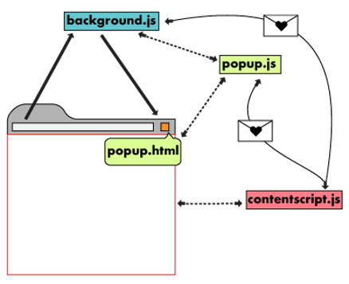

# chrome exetentions v3 实战

## popup.js

### 基本流程

popup.js 没点开一次小窗都会被执行一次。

```js
// 验证每次打开 popup 页面都是重新加载的
chrome.storage.sync.get('total', ({
    total
}) => {
    total++;
    document.getElementById('total').innerHTML = total.toString();
    chrome.storage.sync.set({
        total
    });
});
```

popup.html 中如果有 input，填写完之后关闭小窗，再打开你会发现填写的内容已经没有了，就和刷新了页面一样。

### 作用域

在 popup 中直接获取 dom 节点时，作用域是 popup.html。

```js
const btn = document.getElementById('btn');
```

可以给按钮添加事件:

```js
btn.addEventListener("click", async () => {
    // ...
});
```

但是不能直接访问浏览器中的网站 Dom，下面是一种突破这个限制的方法。

### 操纵网页中的 Dom

chrome extension 提供了方法来获取 tab。

```js
let [tab] = await chrome.tabs.query({
    active: true,
    currentWindow: true
});
```

有了 tab 对象就可以通过 `executeScript` 方法的回调来操作网页中的 dom 节点。

```js
chrome.scripting.executeScript({
    target: {
        tabId: tab.id
    },
    function() {
        // 这里可以获得激活网页的 Dom

        // 自动填写用户名和密码
        const userName = document.getElementById('userName');
        userName.value = 'admin';
        const passWord = document.getElementById('passWord');
        passWord.value = '123456';
    }
});
```

这个方法的本质是将回调函数中的代码注入到页面中，和下面提到的 content scripts 具有很高的相似性。值得注意的是这里的回调并不能访问外面定义的函数，因为在原理上 chrome extension 对各模块是分进程执行的，他们并不共享作用域。

## content script

content script 是注入到页面中的，在网页加载时执行。可为不同的网页配置不同的执行脚本，也可为一类网站配置通用脚本:

```js
"content_scripts": [
    {
        "matches": [
            "http://127.0.0.1:8898/*"
        ],
        "run_at": "document_end",
        "js": ["contentScriptLocalDebug.js"]
    },
    {
        "matches": [
            "https://zhihu.com/*"
        ],
        "run_at": "document_start",
        "js": [
            "jquery-3.6.0.min.js",
            "contentScriptZhihu.js"
        ]
    }
]
```

为了确保 dom 已经加载完成，我们可以将代码放入对 DOMContentLoaded 事件的监听回调中。

```js
document.addEventListener('DOMContentLoaded', () => {
    // ...
});
```

在这里我们可以直接操纵 dom 属性。

```js
// contentScriptLocalDebug.js
// 改变背景颜色
document.body.style.backgroundColor = 'green';
// 直接调出登陆框，无需手动点击
document.getElementById('login-box').style.display = 'block';
// 为表单填值
document.getElementById('userName').value = 'admin';
document.getElementById('passWord').value = '123456';

// contentScriptZhihu.js
// 实战: 去除知乎的侧边栏，让页面更轻爽
const globalSideBar = document.getElementsByClassName('GlobalSideBar')[0];
globalSideBar.parentElement.removeChild(globalSideBar);
document.getElementsByClassName('Topstory-container')[0].style.width = '694px';
```

content script 与 chrome.scripting.executeScript 的回调也有局限性，无法直接调用网页中的 js。

```js
const loginBtn = document.getElementsByClassName('login-btn');
loginBtn[0].click(); // 或者 window.goLogin();
// 报错信息: script.js:8 Refused to run the JavaScript URL because it violates the following Content Security Policy directive: "script-src 'self'"
// 拒绝执行 JavaScript URL，因为违反了内容安全政策指令: "script-src 'self'"
// 注: 为了方便验证，我们直接将方法 goLogin 挂在 window 下做全局方法
```

这里还有一个坑，我们用脚本直接给 dom 赋值有一些依赖事件的函数是不会被触发的，要解决这个问题我们后面会介绍 `chrome.debugger.sendCommand` 相关内容。

无法使用 `chrome.storage`、`chrome.action`、`chrome.tabs`、`chrome.debugger` 等，这些是什么后面会讲到。

但是，只要不在 `executeScript` 的回调函数中，popup.js 中是可以直接使用这些对象的。

## 工具库

上面提到了很多工具库，下面简单介绍一些常用的工具。

### chrome.storage

在最开始的 popup “基本流程” 中已经展示过用法:

```js
// 验证每次打开 popup 页面都是重新加载的
chrome.storage.sync.get('total', ({
    total
}) => {
    total++;
    document.getElementById('total').innerHTML = total.toString();
    chrome.storage.sync.set({
        total
    });
});
```

利用存储的数据我们也可以在小窗中添加列表和其他 Dom 元素，下面就是一个初始化任务列表的示例代码:

```js
// 从 storage 中拉取任务
chrome.storage.sync.get('taskList', ({
    taskList
}) => {
    let result = '';
    if (taskList) {
        taskList.forEach(item => {
            result += `
            <div class="item">
                ${item.companyName}
                <span class="${item.styleClass}">
                    ${item.status}
                </span>
            </div>`;
        });
        const container = document.getElementById('task-container');
        container.innerHTML = result;
    }
});
```

set 示例代码:

```js
chrome.storage.sync.set({
    taskData: data
}, () => {
    // ...
});
```

这个方法可以做数据持久化，更多 API 传送门: https://developer.chrome.com/docs/extensions/reference/storage/。

### chrome.action

chrome.action 有一个非常有用的方法是 `setBadgeText`。

```js
chrome.action.setBadgeText({
    text: request.data.length.toString()
});
```

`setBadgeText` 方法可以在 chrome extension 图标的右下角给一个文本，这在做自动化的插件中是非常有用的，可以用作进度标志和计数器。

action 可以操纵图标，借助 canvas 甚至可以做动画，可以修改 hover 时的 title，更多 API 传送门: https://developer.chrome.com/docs/extensions/reference/action/

### chrome.tabs

上面提到过用来获取当前激活的 tab:

```js
let [tab] = await chrome.tabs.query({
    active: true,
    currentWindow: true
});
```

还有一个重要功能就是打开新 tab:

```js
chrome.tabs.create({
    url: 'https://etax.sichuan.chinatax.gov.cn',
    active: true
});
```

### chrome.windows

如果你开 tab 不满意，还可以开新浏览器窗口:

```js
chrome.windows.create(
    {
        url: 'http://zhihu.com',
        height: 300,
        width: 400
    }
);
```

### chrome.debugger

```js
chrome.debugger.sendCommand(target, "Input.insertText", {
    text: value
}, function (){
    debugger
});
// 报错信息: Unchecked runtime.lastError: Either tab id or extension id must be specified.
// 报错信息: Debugger is not attached
// 报错信息: Error handling response: TypeError: Error in invocation of debugger.attach(debugger.Debuggee target, string requiredVersion, optional function callback): No matching signature.
// 参考:
// https://chromedevtools.github.io/devtools-protocol/tot/Input/#method-insertText
// https://www.jianshu.com/p/6422a1c4b6f2
```

如果上面工具不能满足需求，或者你想探索更多的功能特性，请进入更多工具传送门: https://developer.chrome.com/docs/extensions/reference/

## background

popup 与 content script 是随着 tab 的切换而切换的，只有 background 才是长久驻留浏览器的进程，不同 tab 之间的交互需要依赖 background。

```json
{
    "background": {
        "service_worker": "background.js"
    }
}
```

这在通信中非常有用，如果 popup 不是在打开状态下，那么 content script 是通知不到 popup 的。并且，如果 content script 已经发出了通知，但是 popup 没打开，那么 popup 中的消息监听将会被错过。background 可以很好的弥补这一缺陷，来做一些常驻的功能。

## 通信

首先上一张图，对于消息这是非常重要的一个图:



发送消息:
```js
chrome.runtime.sendMessage({
    name: 'aaa',
    data: {
        num: 123,
        str: '字符串',
        obj: {},
        arr: []
    }
});
```

结束消息:
```js
chrome.runtime.onMessage.addListener(request => {
    if (request.name === 'aaa') {
        chrome.action.setBadgeText({
            text: '👂'
        });
    }
});
```

## 模拟事件

background.js 中接收消息

```js
chrome.runtime.onMessage.addListener((request, sender) => {});
```

attach，在进入模拟前要 attach，否则模拟会报错。

```js
chrome.debugger.attach({
    extensionId: chrome.runtime.id,
    tabId: sender.tab.id
}, '1.3', () => {
    if (chrome.runtime.lastError) {
        // oh no!
    }
    else {
        // ...
    }
});
```

模拟输入，参数文档: https://chromedevtools.github.io/devtools-protocol/tot/Input/#method-insertText

```js
chrome.debugger.sendCommand({
    extensionId: chrome.runtime.id,
    tabId: sender.tab.id,
    x: 2,
    y: 2
}, "Input.insertText", {
    text: '456'
}, () => {
    
});
```

## 跨域请求数据

跨域请求数据的时候会遇到跨域问题，在配置中添加 `host_permissions` 配置:

```json
{
    "host_permissions": [
        "http://127.0.0.1:4000"
    ]
}
```

## 备忘
