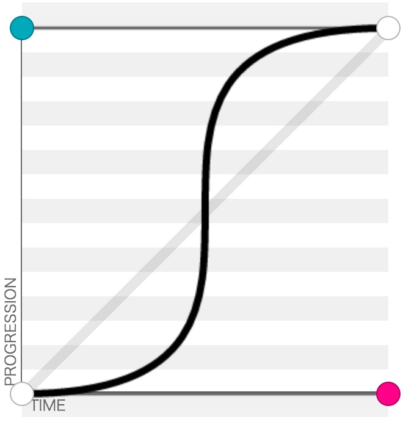

# CSS 动画(一)

> 目前我对于 CSS 动画还是一个菜鸟，从不会到熟练总需要一个过程，本篇从语法开始，记录我的学习，算是一份技术点备忘录吧。

## 过渡 transition

> CSS 动画有两种实现方式，其中较为简单的就是过渡 -- `transition`，在一定的时间区间内平滑地过渡。当通过 `hover` 等伪类、直接改 class 或样式值引起样式变化，`transition`可使样式平滑地过渡。
[示例](/articles/css-animation/demo/transition-quick-start.html)

### 语法概述

语法：

	transition: [transition-property] transition-duration [transition-timing-function] [transition-delay]
	// 也就是：
	transition: [过渡属性] 过渡持续时间 [动画函数] [过渡延迟时间]
	// 多组设置用逗号间隔
	
### 过渡样式

`transition-property` 

- all 默认值，全部可过渡的样式，在下面会给出哪些样式可过渡
- none 不对任何样式进行过渡，当过渡还没完成时突然将过渡属性设为 `none`，过渡会直接跳到结尾，
[示例](/articles/css-animation/demo/transition-property.html)
- 单独属性，并不是所有属性都可以过渡，只有属性具有中间点值才能具备过度效果，这里就不一一列举了，
参见[这里](https://www.w3.org/TR/css3-transitions/#properties-from-css-)

这里需要提醒一点是，并不是什么属性改变都为触发transition动作效果，比如页面的自适应宽度，当浏览器改变宽度时，并不会触发transition的效果。

浏览器支持情况：IE10+，Firefox，Chrome，Safari。

### 过渡持续时间

`transition-duration` 单位为s(秒)或ms(毫秒)，默认值是0，当属性值为零时看不到过渡效果，所以过渡时间是动画事实上的不可缺属性。可以像下面这样使用此属性：

	transition: 0.5s;
	transition: .5s;
	transition: 500ms;

[示例](/articles/css-animation/demo/transition-duration.html)

### 过渡函数

`transition-timing-function` 用来指定变化速度，有如下值可供选择：

- ease 默认值，慢速开始，然后变快，然后慢速结束的过渡效果，等于 cubic-bezier(0.25, 0.1, 0.25, 1)
- linear 以相同速度开始至结束的过渡效果，等于 cubic-bezier(0,0,1,1)
- ease-in 以慢速开始的过渡效果，等于 cubic-bezier(0.42,0,1,1)
- ease-out 以慢速结束的过渡效果，等于 cubic-bezier(0,0,0.58,1)
- ease-in-out 以慢速开始和结束的过渡效果，等于 cubic-bezier(0.42,0,0.58,1)
- cubic-bezier(x1,y1,x2,y2)	在 cubic-bezier 函数中定义自己的值。可能的值是 0 至 1 之间的数值。
- steps(<integer>[, [ start | end ] ]?)：接受两个参数的步进函数。第一个参数必须为正整数，指定函数的步数。第二个参数取值可以是start或end，指定每一步的值发生变化的时间点。第二个参数是可选的，默认值为end。

需要对 `cubic-bezier` 函数的四个参数做一个简单的说明，速度变化采用三次贝塞尔曲线来描述，一条贝塞尔曲线需要四个点来描述如下图：

 

为了简化，在CSS中将决定曲线位置的两点固化，也就是图中白色的两点，他们的坐标分别是(0,0)和(1,1)，留出两个点来供我们自定义曲线的弯曲状态，这两个点必须在[(0,0),(1,0),(1,1),(0,1)]这个范围内，所以定义弯曲状态的两个点的坐标的取值范围是零到一(包括零和一)，前两个值是红点的坐标，后两个值是蓝点的坐标。从图中可以看出“横轴是时间，纵轴是位置”，所以曲线越陡的部分速度越快。可以借助[cubic-bezier.com](http://cubic-bezier.com/)这一网站工具来体验曲线形状和生成坐标点。

[关于过渡方式的示例](/articles/css-animation/demo/transition-timing-function.html)

### 过渡延迟开始时间

`transition-delay` 动画延迟开始的时间，设置上和 `transition-duration` 相同，不同的地方是可以设置负数，这对于组合动画非常有用。

## 动画 animation

> 使用 transition 属性只能通过指定属性的初始状态和结束状态，然后在两个状态之间进行平滑过渡的方式来实现动画。而 animation 可以通过关键帧的定义实现更为复杂细腻的动画。

### 语法概述

通过 `animation` 及其子属性定义动画，通过 `@keyframes` 定义关键帧。先看[快速开始示例](/articles/css-animation/demo/animation-quick-start.html)的样式代码：

	div {
		display: inline-block;
		margin: 100px;
		padding: 20px;
		border-radius: 20px;
		background: #B2EFB2;
	}
	div:hover {
		animation: animation-name 1s 4 alternate;
	}
	@keyframes animation-name {
		100% {
			margin: 0;
			padding: 100px;
			border-radius: 100px;
		}
	}

通过上面的代码就可以实现一个 CSS3 的简单动画。`animation` 共有 8 个子属性，`@keyframes` 相对简单，先给出语法形式，后面一一详述：

	animation: [animation-name] animation-duration [animation-timing-function] [animation-delay] [animation-iteration-count] [animation-direction] [animation-play-state] [animation-fill-mode]
	// 多组用逗号间隔
	@keyframes animation-name {
		from { }
		percent { }
		to { }
	}

### 动画名称

`animation-name` 动画名称，方便通过关键帧定义动画细节，有两个值：

- IDENT 是由 `@keyframes` 创建的动画名称，如果和 `@keyframes` 中的 IDENT 不一致将不能实现任何动画；
- none 默认值，没有任何动画效果，可以用于覆盖任何动画。

### 动画播放时间

`animation-duration` 动画播放时间，默认值为 0，单位是秒，当设为 0 或者负数时没有任何动画，所以播放时间是事实上的比备属性。

### 动画播放方式

`animation-timing-function` 动画播放方式，和 `transition` 的 `animation-timing-function` 相同，不再重复。

### 动画延迟开始时间

`animation-delay`，动画延迟开始时间，和 `transition` 的 `animation-delay` 相同，不再重复。

### 动画播放次数

`animation-iteration-count`，动画播放次数，默认值为 1，可以是小数，设置为 `infinite` 时动画将会无限次地播放。

### 动画播放方向

`animation-direction`，动画播放方向，有两个值：

- normal，默认值，动画每次循环都是向前播放；
- alternate，动画会在奇数次数正常播放，而在偶数次数向后播放，当动画循环播放多次时，此属性可使动画连续不跳动，如[示例](/articles/css-animation/demo/animation-direction.html)。

### 动画播放状态

`animation-play-state`，动画播放状态，有两个值：

- running，默认值，将停下来的动画继续开始；
- paused，使动画暂停。

[示例](/articles/css-animation/demo/animation-play-state.html)

### 动画时间外属性

`animation-fill-model`，有四个值：

- none，默认值，动画按预期进行和结束，在动画完成最后一帧时动画反转到初始帧处；
- forwards，动画结束后继续使用最后关键帧位置；
- backwards，在 `animation-delay` 所指定的一段时间内，在动画显示之前，应用初始帧；
- both，元素动画同时具有 `forwards` 和 `backwards` 效果

### 关键帧

关键帧用来进一步定义动画的过渡效果，可以指定动画在不同阶段的关键帧，以百分比的形似来描述动画阶段。

	@keyframes animation-name {
		from { }
		percent { }
		to { }
	}

`form` 和 `to`可以用 0% 和 100% 代替，也可以多个百分比公用一个关键帧，如下：

	@keyframes animation-name {
		10%, 20% { }
	}

## 参考网站

[CSS3中的Transition属性详解](http://www.php100.com/html/webkaifa/DIV_CSS/2012/1029/11403.html)

[CSS 实现的加载动画](http://vadimsva.github.io/waitMe/)
