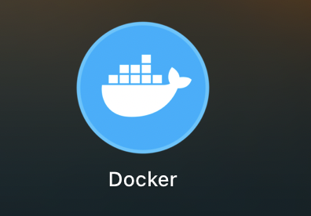
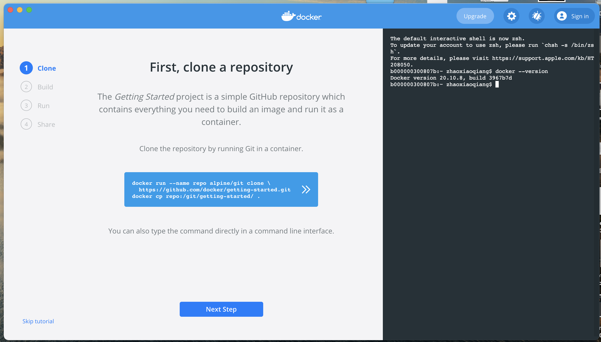
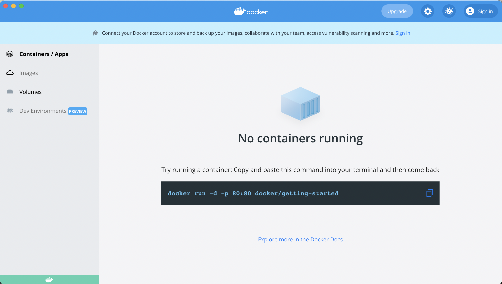
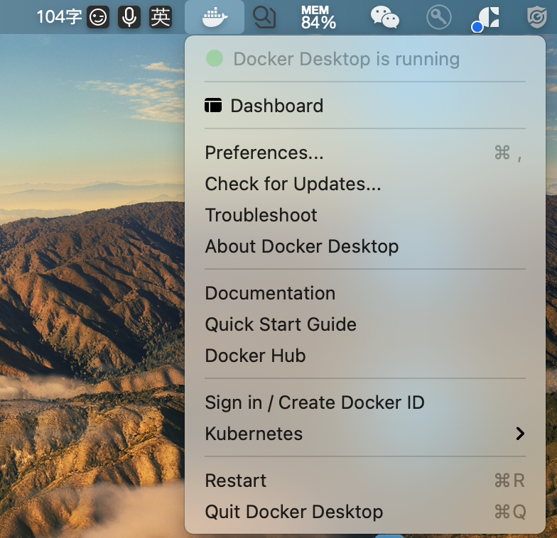
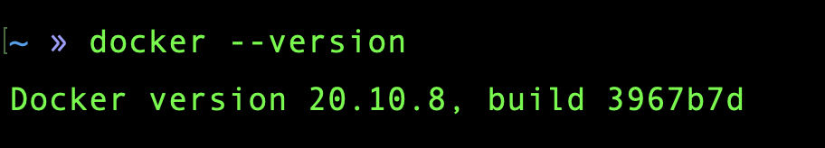
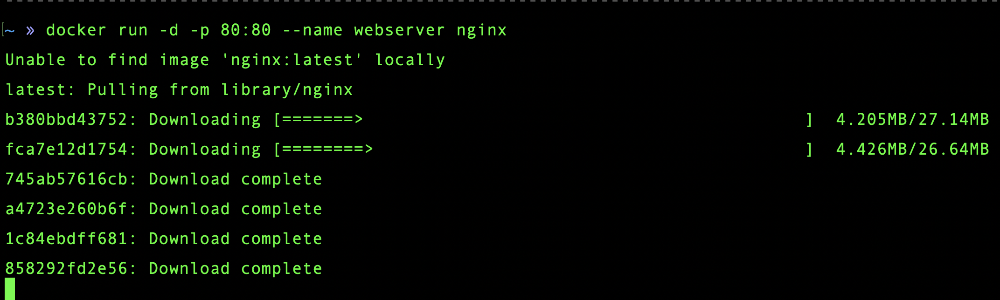

## 手动安装完成 Docker 后

手动安装完成后在程序列表中会有鲸鱼图标，点击可运行

程序运行起来出现如下界面:

直接跳过到这里:

可以在顶部看到图标，点开如下:

在控制台敲命令可以看到 docker:

注: 我的 Mac 版本号是 11.2.3。

注册 docker:
用户名/Docker ID: longzexq
邮箱 longze_xq
密码 ln_y

## 试着启动 nginx

我的思考:
原以为这里应该只完成了 Docker 的安装，没用镜像被安装进 Docker，更不可能运行容器，启动 nginx 应该会失败。

但实际情况是本地没有找到，然后直接从网上下载。

也就是说 Docker 已经有了一个最小系统，通过镜像的方式往里装软件。