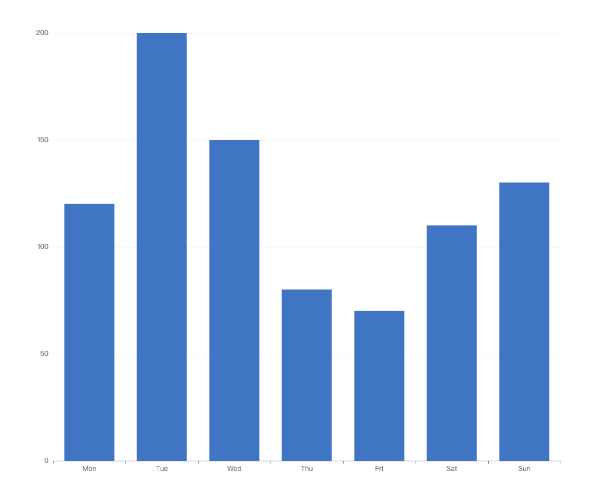
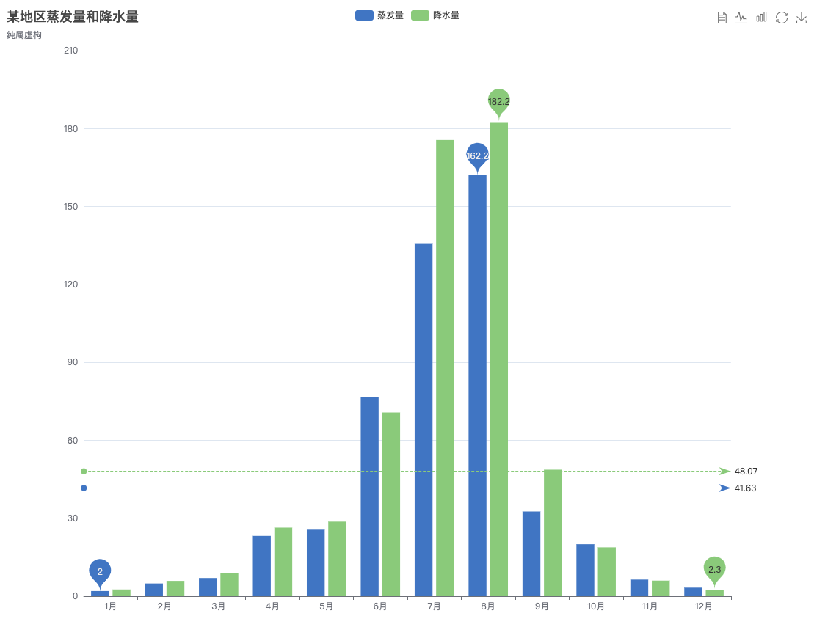
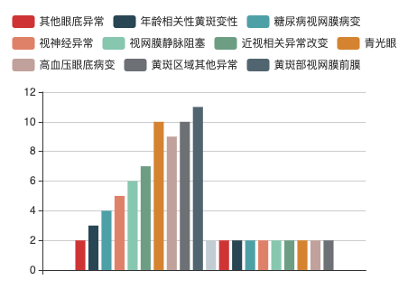

# echart 使用笔记

> echart 是图表界的扛把子，基本是必备技能，学习并记录。

## 概述

官网: https://echarts.apache.org/zh/index.html

- 第一步，你可以在示例中得到你想要的图形；
- 第二步，当你需要对图形做定制化的调整时，你会发现太多的配置无从找起，这时要回头看看[ECharts 基础概念概览](https://echarts.apache.org/zh/tutorial.html#ECharts基础概念概览)；
- 第三步，你可以一头扎进[配置项](https://echarts.apache.org/zh/option.html#title)文档，去寻找你想要的配置项；
- 第四步，

## 知识点

### 基础概念

系列(series): 一组数值以及他们映射成的图。

系列的类型(series.type): line(折线图)、bar(柱状图)、pie(饼图)、scatter(散点图)、graph(关系图)、tree(树图)等，更多配置在: https://echarts.apache.org/zh/option.html#series

组件(component)，在系列之上，echarts 中各种内容，被抽象为“组件”。比如legend(图例)、xAxis(直角坐标系 X 轴)、tooltip(提示框组件)、toolbox(工具栏组件)等。

组件的定位，不同的组件有不同的定位方式。多数组件和系列，都能够基于 top / right / down / left / width / height 绝对定位。 

```js
grid: {
    top: 80,
    left: '30%',
    bottom: 13
}
```

### 图例 legend

图例

```js
{
    // 图例在图标中的位置
    x: 'center',
    y: 'top'
}
```

对应文档: https://echarts.apache.org/zh/option.html#legend

### 柱状图 bar

让柱状图有图例的技巧。基础的柱状图是 x 轴写数字，柱使用同一种颜色。

```js
option = {
    xAxis: {
        type: 'category',
        data: ['Mon', 'Tue', 'Wed', 'Thu', 'Fri', 'Sat', 'Sun']
    },
    yAxis: {
        type: 'value'
    },
    series: [{
        data: [120, 200, 150, 80, 70, 110, 130],
        type: 'bar'
    }]
};
```


双柱状图中可以展示多个颜色:



代码参见官方示例: https://echarts.apache.org/examples/zh/editor.html?c=bar1

如果我们想要下面这种怎么办呢？



把多列数据转到一列中就可以:

```js
options = {
    // 图例
    legend: {
        x: 'center',
        y: 'top'
    },
    // x 轴
    xAxis: {
        type: 'category',
        show: true
    },
    // y 轴
    yAxis: {},
    dataset: {
        dimensions: ['title', '糖网', '青光眼', '黄斑区域病变'],
        source: [
            {title: '', '糖网': 43.3, '青光眼': 85.8, '黄斑区域病变': 93.7}
        ]
    },
    series: [{
        type: 'bar',
        barMaxWidth: 30
    }, {
        type: 'bar',
        barMaxWidth: 30
    }, {
        type: 'bar',
        barMaxWidth: 30
    }],
    // 柱状图位置设置
    grid: {
        top: 90,
        bottom: 13
    }
}
```

### 系列 series

上面的 series 中重复出现了这样的配置:

```js
series: [{
    type: 'bar',
    barMaxWidth: 30
}, {
    type: 'bar',
    barMaxWidth: 30
}, {
    type: 'bar',
    barMaxWidth: 30
}]
```

这里的数据不仅可以全部是柱状图，还可以是别的形式，比如折线图，官网有这样一个示例: 


它的 series 是这样设置的:

```js
series: [
    {
        name: '蒸发量',
        type: 'bar',
        data: [2.0, 4.9, 7.0, 23.2, 25.6, 76.7, 135.6, 162.2, 32.6, 20.0, 6.4, 3.3]
    },
    {
        name: '降水量',
        type: 'bar',
        data: [2.6, 5.9, 9.0, 26.4, 28.7, 70.7, 175.6, 182.2, 48.7, 18.8, 6.0, 2.3]
    },
    {
        name: '平均温度',
        type: 'line',
        yAxisIndex: 1,
        data: [2.0, 2.2, 3.3, 4.5, 6.3, 10.2, 20.3, 23.4, 23.0, 16.5, 12.0, 6.2]
    }
]
```

这里还有一个发现，同样的效果有不同的配置方式，比如上面这个既可以将数据存放在 dataset 中，也可以将数据存放在 series 中。

然后在对比中你会对 echarts 有更深入的理解。
