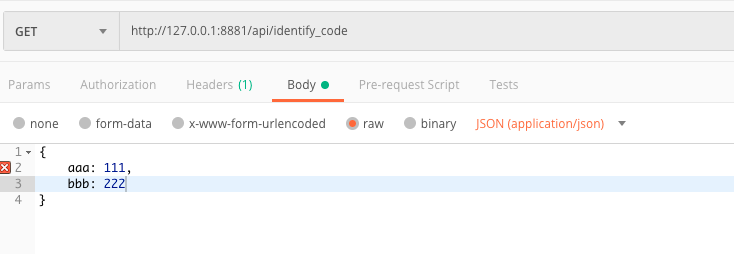
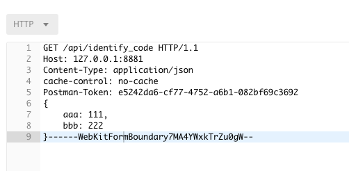
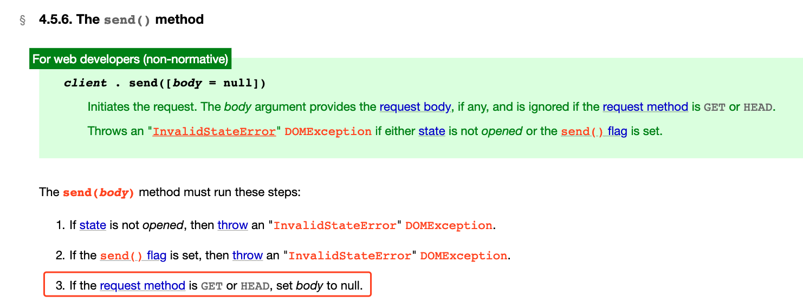

# HTTP

> 关于协议的那些备忘信息

## Content-Type

POST: 提交数据时Content-Type的不同配置会导致数据以不同的形式来传递。

application/x-www-form-urlencoded  ->  Form Data  表单式的打平的数据

multipart/form-data -> Request Payload   会把数据像GET请求那样拼在地址里面，异步发送文件流必用此配置

application/json   -> Request Payload    结构化的 JSON 数据

## 跨域

在返回头(Response Headers)中配置 Access-Control-Allow-Origin，星号表示允许所有域名下的页面请求和使用返回的数据，也可以单独配置

Access-Control-Allow-Origin:http:*

Access-Control-Allow-Origin:http://www.baidu.com

Access-Control-Allow-Methods:POST

## 不要用 get 发送 body

GET 请求把数据放进 body 中后端可以方便的解析。

什么？GET 还有 body？查了一下确实没有...

然后后端在 postman 上给我模拟了出来，啪啪打脸。靠还真的可以有...

postman 的环境和报文是下面这样的：

;

其实就是不安规范强加进来，那我们要妥协加进来吗？不可以，因为浏览器端就不支持([浏览器规范传送门](https://xhr.spec.whatwg.org/#the-send()-method))：

那如果我做的是客户端能这么搞吗，不可以，技术上支持了还有其他的坑，这个毕竟不是规范，如果有代理的话 GET 的 body 可能被吃掉，如果不知道问题在这，然后死都不知道怎么死的。

用规范怼他很容易，要讲明白为什么有这个规范，工程中不准守规范有什么问题，知其然知其所以然，对提高自己在团队的技术影响力和个人技术水平很有帮助。

## 参考

https://juejin.im/post/5afad7f16fb9a07abf72ac30
