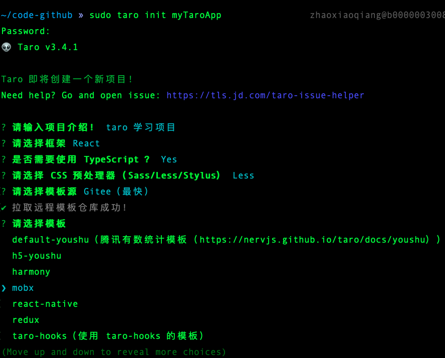

# Taro 入门笔记

## 安装脚手架

```shell
# 使用 npm 安装 CLI
$ npm install -g @tarojs/cli

# OR 使用 yarn 安装 CLI
$ yarn global add @tarojs/cli

# OR 安装了 cnpm，使用 cnpm 安装 CLI
$ cnpm install -g @tarojs/cli
```

## 初始化项目

```shell
taro init myApp

# npm 5.2+ 也可在不全局安装的情况下使用 npx 创建模板项目：
$ npx @tarojs/cli init myApp
```

初始化的时候有很多选项，可以选择 Vue 或 React 技术栈，还有一些模板可以选择。



## 启动项目

```shell
# 安装依赖
yarn
# 运行小程序(微信)
yarn dev:weapp
```

Taro 是跨平台的框架，他的原理是从 TS 做一层转译，转译成不同的小程序版本。

运行开发模式后会实时监听文件改变，生成对应的小程序代码。

我选择了比较熟悉的微信小程序，需要下载微信小程序开发工具: https://developers.weixin.qq.com/miniprogram/dev/devtools/download.html

然后用微信小程序开发工具打开项目编译出的 dist 文件夹作为项目。

在小程序的预览框中就可以看到页面了。

## 源码代码要点

