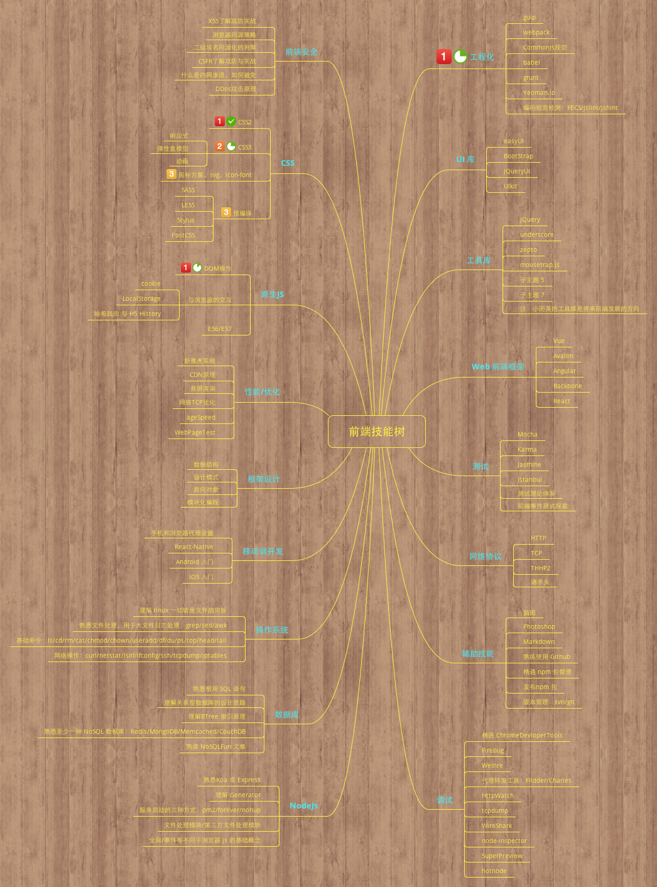

# 脑图工具 XMind

> 今天要画一张脑图，换了 Mac 之后的第一张脑图，找了几个画脑图的软件发现这个最好用(有收费版的可能更好用，但是我不愿意做破解的事情)，简单记录一下使用，也当做工具链的一环。

## 常用快捷方式总结

Enter  插入同级节点

Tab    插入子节点

## 常用操作

文件/导出/图片    保存为图片

## 脑图内容

为了填充自己的知识体系，把能想到的关于前端的东西画了一张脑图出来。还在整理和填充中，如果觉得哪里有遗漏欢迎提供意见。这个工具支持添加重要性标识和完成度，我打算用 2-3 年的时间通关这张图，寻找同行的队友。

 

[xmind 源文件](/articles/xmind/img/fe-skill-tree.xmind)

## 扩展资源

[developer-roadmap](https://github.com/kamranahmedse/developer-roadmap)

## todo

找在线带链接的方式
